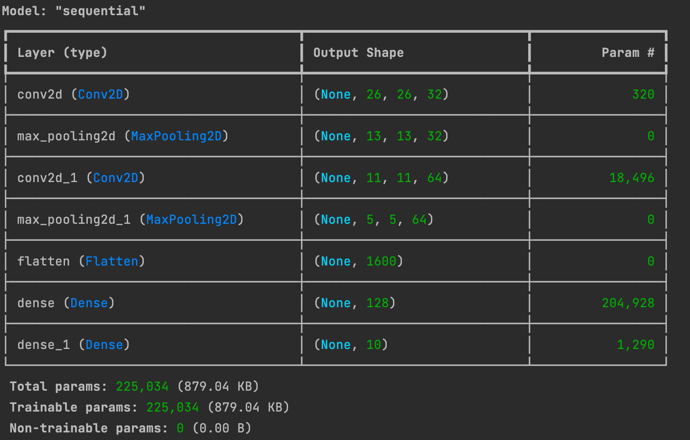

# 패션 아이템 분류 모델 구현

- 학습 목표: tf.keras를 이용한 모델 생성, 데이터 정규화, 과적합(Overfitting) 이해.
- 데이터셋: tf.keras.datasets.fashion_mnist (내장 데이터셋)

## 첫 모델
```python
tf.keras.Sequential([
    tf.keras.layers.Conv2D(32, (3, 3), activation='relu', input_shape=(28, 28, 1)),
    tf.keras.layers.MaxPooling2D((2, 2)),
    tf.keras.layers.Conv2D(64, (3, 3), activation='relu'),
    tf.keras.layers.MaxPooling2D((2, 2)),
    tf.keras.layers.Flatten(),
    tf.keras.layers.Dense(128, activation='relu'),
    tf.keras.layers.Dense(10, activation='softmax')
])
```


### 결과


### 평과
10회(Epoch 9) 학습 결과, 훈련 정확도는 약 95.5%, 검증 정확도는 약 91.5% 정도를 기록합니다.
이는 패션 아이템 10개 중 9개 이상을 정확히 맞추고 있다는 뜻입니다.

Epoch 0에서 2 사이의 정확도가 가파르게 상승하는 것으로 보아, 모델이 데이터의 핵심 특징을 아주 빠르게 파악하고 있습니다.

Epoch 2~3 지점부터 파란색 선(train_accuracy)과 주황색 선(val_accuracy) 사이의 간격이 점점 넓어지기 시작합니다.

파란색 선은 멈추지 않고 계속 올라가고 있지만, 주황색 선은 Epoch 5 이후부터 91% 근처에서 정체(Plateau)되거나 소폭 진동하고 있습니다.