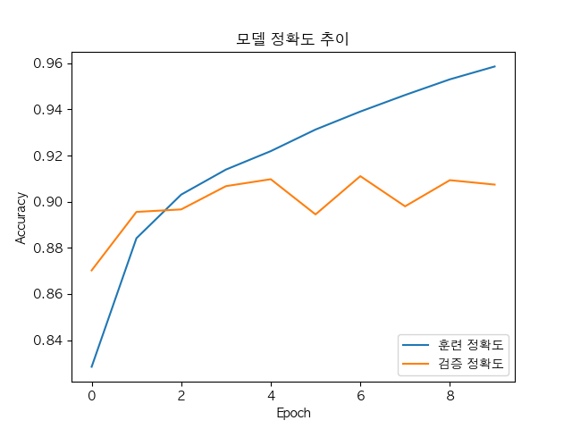
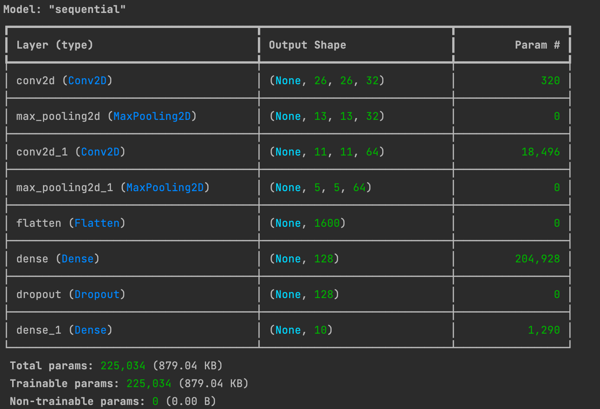
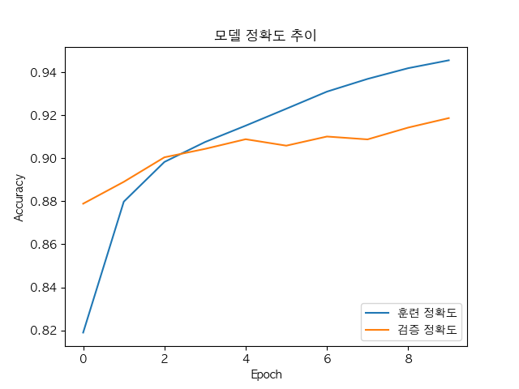
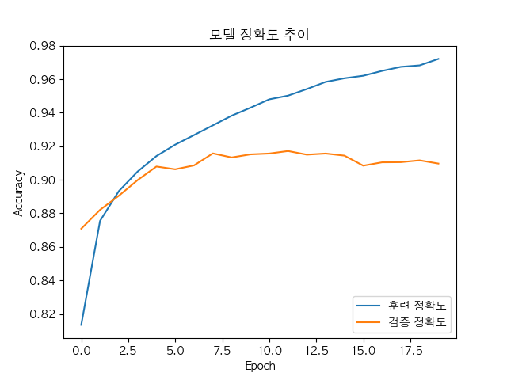
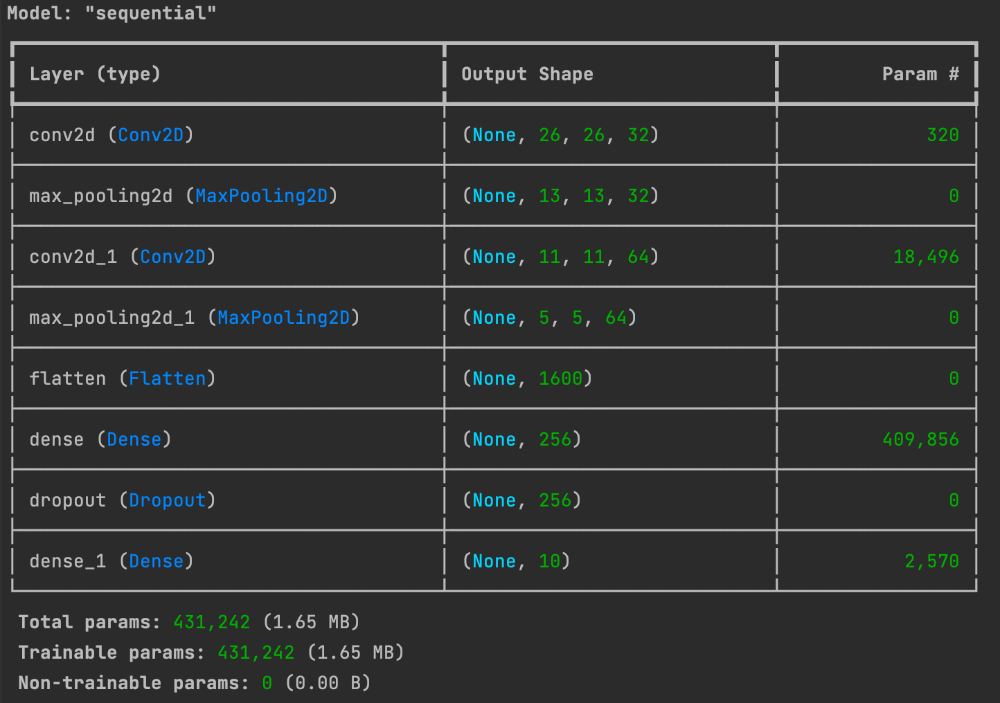
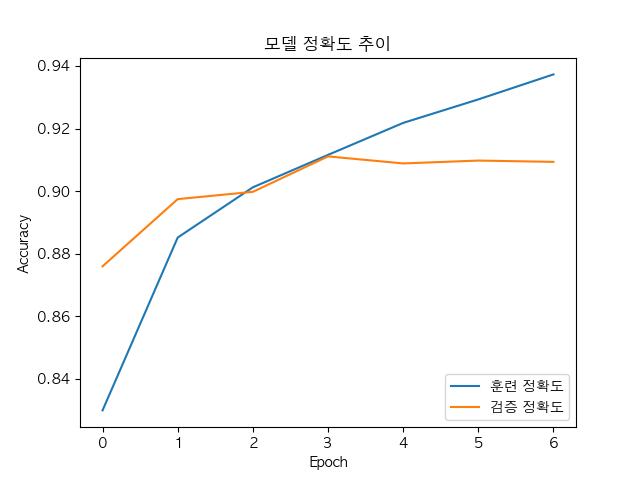

# 패션 아이템 분류 모델 구현

- 학습 목표: tf.keras를 이용한 모델 생성, 데이터 정규화, 과적합(Overfitting) 이해.
- 데이터셋: tf.keras.datasets.fashion_mnist (내장 데이터셋)

## 첫 모델
```python
tf.keras.Sequential([
    tf.keras.layers.Conv2D(32, (3, 3), activation='relu', input_shape=(28, 28, 1)),
    tf.keras.layers.MaxPooling2D((2, 2)),
    tf.keras.layers.Conv2D(64, (3, 3), activation='relu'),
    tf.keras.layers.MaxPooling2D((2, 2)),
    tf.keras.layers.Flatten(),
    tf.keras.layers.Dense(128, activation='relu'),
    tf.keras.layers.Dense(10, activation='softmax')
])
```


### 결과


### 평가
10회(Epoch 9) 학습 결과, 훈련 정확도는 약 95.5%, 검증 정확도는 약 91.5% 정도를 기록합니다.
이는 패션 아이템 10개 중 9개 이상을 정확히 맞추고 있다는 뜻입니다.

Epoch 0에서 2 사이의 정확도가 가파르게 상승하는 것으로 보아, 모델이 데이터의 핵심 특징을 아주 빠르게 파악하고 있습니다.

Epoch 2~3 지점부터 파란색 선(train_accuracy)과 주황색 선(val_accuracy) 사이의 간격이 점점 넓어지기 시작합니다.

파란색 선은 멈추지 않고 계속 올라가고 있지만, 주황색 선은 Epoch 5 이후부터 91% 근처에서 정체(Plateau)되거나 소폭 진동하고 있습니다.

## Dropout을 추가한 두번째 모델
```python
tf.keras.Sequential([
    # 이미지의 특징을 추출하는 부분 (Feature Extraction)
    tf.keras.layers.Conv2D(32, (3, 3), activation='relu', input_shape=(28, 28, 1)),
    tf.keras.layers.MaxPooling2D((2, 2)),
    tf.keras.layers.Conv2D(64, (3, 3), activation='relu'),
    tf.keras.layers.MaxPooling2D((2, 2)),

    # 추출된 특징을 1차원으로 펼쳐 분류하는 부분 (Classification)
    tf.keras.layers.Flatten(),
    tf.keras.layers.Dense(128, activation='relu'),
    tf.keras.layers.Dropout(0.2), # 20%의 뉴런을 무작위로 쉬게 함
    tf.keras.layers.Dense(10, activation='softmax') # 10개 카테고리 분류
])
```


### 결과


### 평가
이전 그래프에서는 에포크 4를 넘어가면서 훈련 정확도(파란색)는 치솟는데 검증 정확도(주황색)는 제자리걸음이었습니다. 

하지만 지금은 두 곡선이 서로를 꼭 붙잡고 함께 올라가는 형태가 되었습니다. 

이는 모델이 훈련 데이터에만 집착하지 않고, 보편적인 특징을 잘 배우고 있다는 뜻입니다.

## 두번째 모델 epoch를 10 -> 20 으로 변경

### 결과


### 평가
Dropout(0.2)을 넣었음에도 불구하고, 학습 횟수(Epoch)가 너무 많아지자 모델이 다시 학습 데이터의 사소한 특징(노이즈)까지 외우기 시작했습니다.

- 에포크 0~10: 실력이 실제로 향상되는 구간 (성장기)
- 에포크 10~20: 새로운 걸 배우기보다 정답지를 통째로 암기하는 구간 (과적합기)

무조건 많이 학습시킨다고 좋은 것은 아니다는 결과를 도출하였습니다.
해당 결과 이후 모델 학습 시 EarlyStopping을 추가하였습니다.

## Dense의 노드 수를 2배로 늘린 두번째 모델
```python
tf.keras.Sequential([
    # 이미지의 특징을 추출하는 부분 (Feature Extraction)
    tf.keras.layers.Conv2D(32, (3, 3), activation='relu', input_shape=(28, 28, 1)),
    tf.keras.layers.MaxPooling2D((2, 2)),
    tf.keras.layers.Conv2D(64, (3, 3), activation='relu'),
    tf.keras.layers.MaxPooling2D((2, 2)),

    # 추출된 특징을 1차원으로 펼쳐 분류하는 부분 (Classification)
    tf.keras.layers.Flatten(),
    tf.keras.layers.Dense(256, activation='relu'),
    tf.keras.layers.Dropout(0.2), # 20%의 뉴런을 무작위로 쉬게 함
    tf.keras.layers.Dense(10, activation='softmax') # 10개 카테고리 분류
])
```


### 결과


### 평가
실제 에포크 실시 횟수는 줄었으나, 정확도에는 큰 변화를 확인하기는 어려웠습니다.

